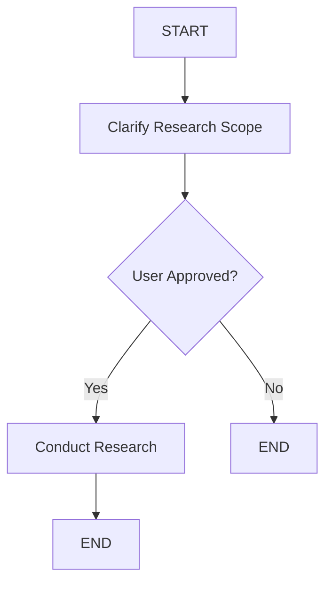

# LangGraph Deep Research Agent - Deployment Guide

## Overview

This is a LangGraph deep research agent that conducts comprehensive research through a two-stage process:

1. **User Interaction Stage**: Interactive terminal-based conversation to clarify research scope, depth, target audience, and specific questions
2. **Research Stage**: Uses a ReAct agent with Tavily search to conduct thorough research and generate a detailed report

## Features

- **Interactive Scope Clarification**: Uses LangGraph's `interrupt()` function for human-in-the-loop interaction
- **ReAct Research Agent**: Powered by `create_react_agent` with Tavily web search capabilities
- **Comprehensive Research**: Multi-query search strategy for thorough information gathering
- **Deployment Ready**: Configured for LangGraph Platform deployment
- **Memory Support**: Uses checkpointers for conversation persistence

## Prerequisites

- Python 3.8+
- [Anthropic API Key](https://console.anthropic.com/settings/keys)
- [Tavily API Key](https://tavily.com/)
- LangGraph CLI (for deployment)

## Local Setup

1. **Clone and navigate to the project:**
   ```bash
   cd /path/to/your/project
   ```

2. **Install dependencies:**
   ```bash
   pip install -r requirements.txt
   ```

3. **Set up environment variables:**
   ```bash
   cp .env.template .env
   # Edit .env and add your API keys
   ```

4. **Test locally:**
   ```bash
   python agent.py
   ```

## LangGraph Platform Deployment

### Option 1: Local Development Server

1. **Install LangGraph CLI:**
   ```bash
   pip install langgraph-cli
   ```

2. **Start development server:**
   ```bash
   langgraph dev
   ```

3. **Access at:** `http://localhost:8123`

### Option 2: Cloud Deployment

1. **Create a GitHub repository** with your code

2. **Push to GitHub:**
   ```bash
   git init
   git add .
   git commit -m "Initial commit: LangGraph Deep Research Agent"
   git remote add origin https://github.com/yourusername/your-repo.git
   git push -u origin main
   ```

3. **Deploy via LangGraph Platform:**
   - Go to [LangGraph Platform](https://langchain.com/platform)
   - Connect your GitHub repository
   - Configure environment variables (ANTHROPIC_API_KEY, TAVILY_API_KEY)
   - Deploy

## Usage

### Via LangGraph Platform

1. **Start a new thread** in the platform
2. **Send any message** to begin the research process
3. **Follow the interactive prompts** to clarify your research needs:
   - Research topic
   - Scope and depth
   - Target audience
   - Specific questions
   - Brief approval
4. **Review the final research report**

### Via API

```python
import requests

# Start research session
response = requests.post(
    "https://your-deployment-url/runs/stream",
    json={
        "input": {"messages": [{"role": "user", "content": "Start research"}]},
        "config": {"configurable": {"thread_id": "research-session-1"}}
    }
)

# Handle interrupts and provide responses
# (Implementation depends on your client setup)
```

### Via SDK

```python
from langgraph_sdk import get_client

client = get_client(url="https://your-deployment-url")

# Create assistant
assistant = client.assistants.create(
    graph_id="research_agent",
    config={"configurable": {}}
)

# Start research thread
thread = client.threads.create()

# Begin research
run = client.runs.create(
    thread["thread_id"],
    assistant["assistant_id"],
    input={"messages": [{"role": "user", "content": "Start research"}]}
)

# Handle the interactive flow through the SDK
```

## Architecture

### Components

1. **ResearchState**: Pydantic model defining the workflow state
2. **clarify_research_scope**: Interactive node using `interrupt()` for user input
3. **conduct_research**: ReAct agent node with Tavily search tool
4. **StateGraph**: Main workflow orchestration
5. **Conditional Edges**: Route based on user approval

### Workflow



### Key Features

- **Human-in-the-Loop**: Multiple `interrupt()` calls for scope clarification
- **ReAct Pattern**: Reason-Act-Observe cycle for research
- **Multi-Query Search**: Strategic search queries for comprehensive coverage
- **Structured Output**: Well-formatted research reports
- **Error Handling**: Graceful handling of API errors

## Configuration

### Environment Variables

- `ANTHROPIC_API_KEY`: Your Anthropic API key
- `TAVILY_API_KEY`: Your Tavily search API key

### Graph Configuration

Edit `langgraph.json` to modify:
- Dependencies
- Graph exports
- Environment file references

## Troubleshooting

### Common Issues

1. **Missing API Keys**: Ensure both ANTHROPIC_API_KEY and TAVILY_API_KEY are set
2. **Import Errors**: Verify all dependencies are installed via `requirements.txt`
3. **Interrupt Handling**: Ensure you're using a checkpointer for interrupt functionality
4. **Deployment Issues**: Check logs in LangGraph Platform for specific errors

### Debug Mode

Enable debug logging by setting:
```bash
export LANGSMITH_TRACING=true
export LANGSMITH_API_KEY=your_langsmith_key
```

## Next Steps

- **Customize Prompts**: Modify research prompts in `conduct_research` function
- **Add Tools**: Extend the ReAct agent with additional search or analysis tools
- **Enhanced Memory**: Implement long-term memory for multi-session research
- **UI Integration**: Connect with Agent Chat UI for better user experience
- **Evaluation**: Add research quality evaluation metrics

## Support

For issues related to:
- **LangGraph**: [LangGraph Documentation](https://langchain-ai.github.io/langgraph/)
- **Anthropic**: [Anthropic Documentation](https://docs.anthropic.com/)
- **Tavily**: [Tavily Documentation](https://tavily.com/docs)