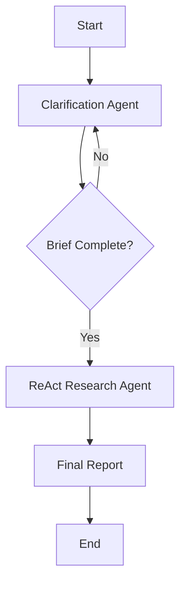

# LangGraph Deep Research Agent

A sophisticated research agent built with LangGraph that conducts thorough research through a two-stage process:

1. **Clarification Stage**: Interactive back-and-forth with the user via terminal to understand research scope
2. **Research Stage**: ReAct agent with Tavily search conducts comprehensive research and generates detailed reports

## Features

- ✅ **Human-in-the-Loop Clarification**: Uses `interrupt()` to pause execution for user input
- ✅ **Structured Research Brief Generation**: Creates detailed research briefs from user clarifications
- ✅ **ReAct Agent with Search**: Uses Tavily search for comprehensive research
- ✅ **Detailed Report Generation**: Synthesizes findings into well-structured reports
- ✅ **LangGraph Platform Deployable**: Ready for deployment on LangGraph Platform

## Architecture



## Setup

1. **Clone and Install Dependencies**:
   ```bash
   pip install -r requirements.txt
   ```

2. **Set Environment Variables**:
   ```bash
   cp .env.example .env
   # Edit .env with your API keys
   ```

3. **Required API Keys**:
   - `ANTHROPIC_API_KEY`: For Claude model access
   - `TAVILY_API_KEY`: For search functionality

## Local Development

To test the agent locally with human-in-the-loop functionality:

```python
python agent.py
```

This runs a test scenario that demonstrates the clarification process.

## Deployment on LangGraph Platform

The agent is configured for deployment on LangGraph Platform:

1. **Using LangGraph CLI**:
   ```bash
   pip install langgraph-cli
   langgraph dev  # For local server
   ```

2. **Deploy to LangGraph Cloud**:
   - Push to GitHub repository
   - Connect to LangGraph Platform
   - The `langgraph.json` configures the deployment

## Usage

### Basic Usage

```python
from agent import app

# For deployment (no checkpointer)
result = app.invoke({
    "original_query": "Research the impact of AI on job markets",
    "clarification_complete": False,
    "current_stage": "clarification"
})
```

### With Human-in-the-Loop (Local Testing)

```python
from langgraph.checkpoint.memory import InMemorySaver
from langgraph.types import Command

# Add checkpointer for interrupts
checkpointer = InMemorySaver()
graph = workflow.compile(checkpointer=checkpointer)

config = {"configurable": {"thread_id": "session_1"}}

# Start research
result = graph.invoke({
    "original_query": "Your research question here",
    "clarification_complete": False,
    "current_stage": "clarification"
}, config=config)

# Handle interrupts
if "__interrupt__" in result:
    # Respond to clarification questions
    result = graph.invoke(
        Command(resume="Your answer here"),
        config=config
    )
```

## State Schema

```python
class ResearchState(TypedDict):
    original_query: str          # User's initial research request
    research_brief: str          # Generated research brief
    clarification_complete: bool # Whether clarification is done
    final_report: str           # Generated research report
    current_stage: Literal["clarification", "research", "completed"]
```

## Key Components

### 1. Clarification Agent
- Uses structured output to generate clarification questions
- Employs `interrupt()` for terminal-based user interaction
- Builds comprehensive research brief from user responses
- Confirms brief accuracy before proceeding

### 2. ReAct Research Agent
- Built with `create_react_agent()` prebuilt component
- Uses Tavily search tool for information gathering
- Follows research brief to ensure comprehensive coverage
- Generates detailed, well-structured reports

### 3. Workflow Orchestration
- StateGraph coordinates between agents
- Conditional edges based on clarification completion
- Proper state management throughout the process

## Customization

### Adding New Search Tools
```python
from your_tool import YourSearchTool

# In research_agent_node function
react_agent = create_react_agent(
    model=model,
    tools=[tavily_search, YourSearchTool()],  # Add your tools
    prompt=research_prompt
)
```

### Modifying Clarification Questions
Edit the `clarification_agent` function to customize:
- Number of questions asked
- Types of clarifications requested
- Brief generation logic

### Custom Report Formats
Modify the research agent prompt to specify different report structures, formats, or focus areas.

## Deployment Configurations

### LangGraph Platform
- Uses `langgraph.json` for configuration
- No checkpointer for stateless deployment
- Environment variables managed through platform

### Self-Hosted
- Add checkpointer for human-in-the-loop functionality
- Configure persistent storage as needed
- Handle API keys securely

## Troubleshooting

### Missing API Keys
The agent includes fallback mock search for development without API keys. Set proper environment variables for production use.

### Import Issues
If you see Tavily import warnings, the agent automatically falls back to the community package version.

### Graph Compilation Errors
Ensure all nodes return proper state dictionaries and conditional edges have valid return values.